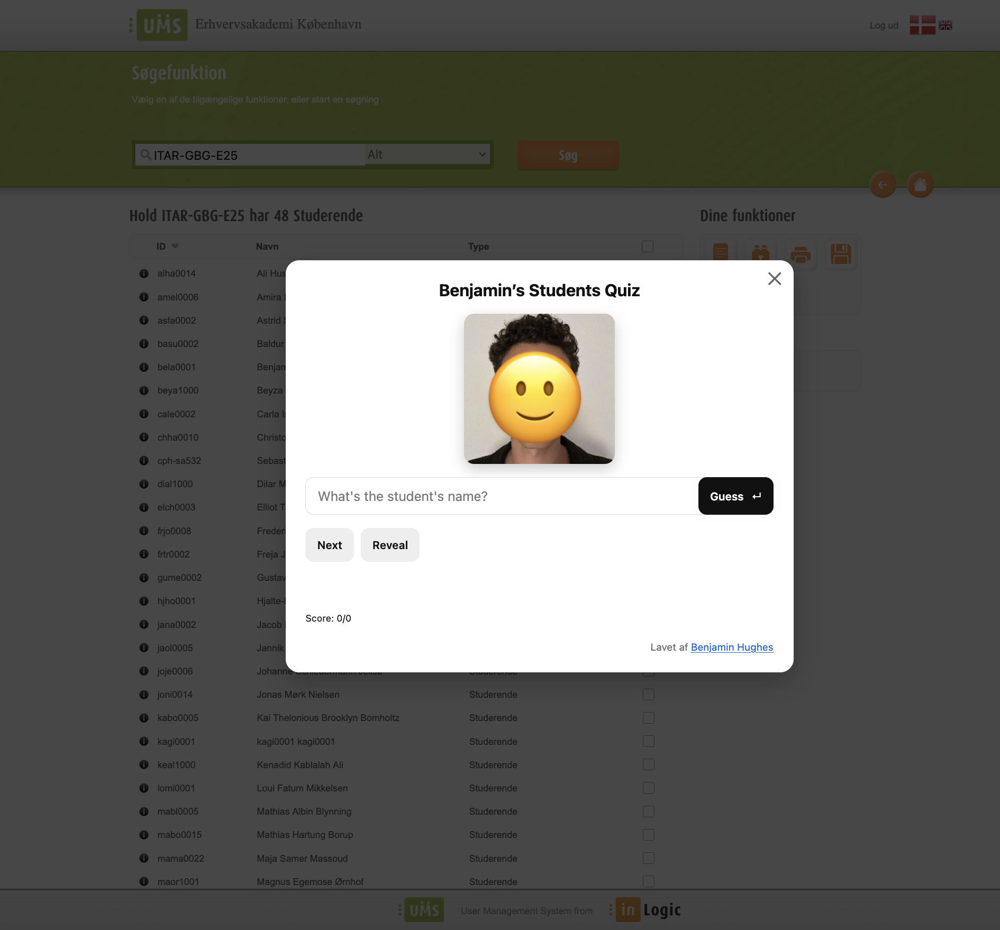
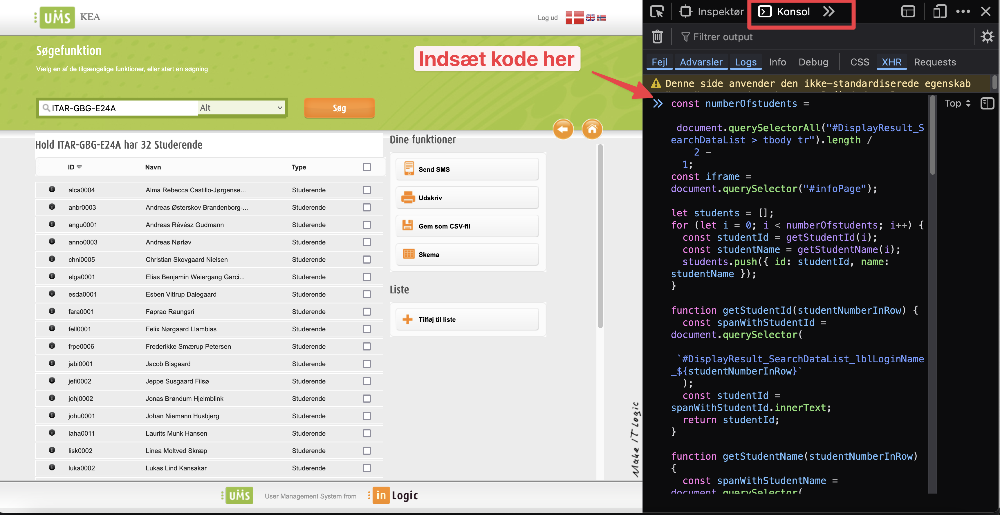

# Studenter navnequiz

Jeg har lavet en quiz der kan hjælpe en med at huske de studerendes navne

## Fremgangsmåde

For at få quizzen til at virke gå ind på [https://ums.kea.dk/](https://ums.kea.dk/). Søg din klasse frem og klik på klassen. Når du står i det view hvor man kan se sin klasse. 

Gør nu følgende:

1. Åbn browserens Inspector værktøj. Højreklik og tryk på Inspicer/Undersøg. Hvis du ikke har Inspector værktøj installeret så prøv at google din browser og så inspector tool install. Fx `"Safari Inspector tool install"`
2. Tryk på Konsol/Console
3. Kopier javascripten [herfra](https://github.com/behu-kea/student-quiz/blob/main/student-quix.js)
4. Paste den ind i Konsol/Console. Tryk på enter
5. Nu skulle det gerne se sådan her ud:

